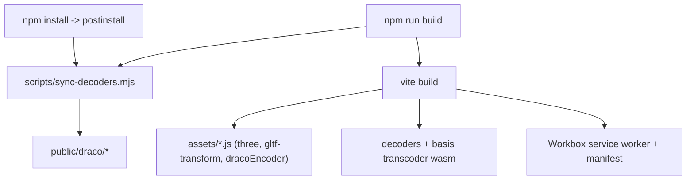

# 🏛️ Architecture & System Design - Glbify

## 📌 1. Project Overview

Glbify is a 100% client-side 3D model converter, viewer and scale optimizer. It runs entirely in the browser,
bundled with Vite, works offline as a PWA and never sends assets to a server.

## 🛠️ 2. Technology Stack

- **Core Engine**: Three.js (r186)
- **Loaders**: `FBXLoader`, `GLTFLoader`, `OBJLoader`, `STLLoader`, `USDLoader`
- **Exporters**: `GLTFExporter` (binary GLB), `USDZExporter`, `STLExporter`, `OBJExporter`
- **Compression**: `DRACOLoader` (decode), glTF-Transform + `draco3dgltf` (encode)
- **Textures**: `KTX2Loader` (Basis Universal), `MeshoptDecoder`
- **UI & Controls**: OrbitControls, Tailwind CSS 4 (glassmorphic dark theme)
- **Runtime**: Vite 8 + vanilla ES modules, no framework

## 📐 3. Data Processing Pipeline

```mermaid
flowchart LR
    Input["Drop / Upload (.fbx .glb .gltf .obj .mtl .stl .ply .3mf .usdz)"] --> Limit{"Size ok, not empty?"}
    Limit -->|No| Reject["Toast: limit aşıldı / dosya boş"]
    Limit -->|Yes| Read["Chunked File.stream() read + progress"]
    Read --> Parse["importer.parse (io/importers.js)"]
    Parse --> Prepare["io/materials.js: Phong -> Standard, color spaces"]
    Prepare --> Audit["io/materials.js: renk uzayı denetimi"]
    Audit --> Scene["core/viewer.js: center + fit + grid"]
    Scene --> Gizmo["core/transformController.js: gizmo + unit scale"]
    Scene --> Anim["core/animator.js: klip / transport"]
    Gizmo --> Export["exporters[format].run (io/exporters.js)"]
    Anim --> Export
    Export --> Post{"GLB && (DRACO || doku işlemi)?"}
    Post -->|Yes| PostPass["io/gltfPostprocess.js: draco() + doku"]
    Post -->|No| Blob["Blob URL download"]
    PostPass --> Blob
```



## 🗂️ 4. Module Boundaries

| Layer | Responsibility |
| --- | --- |
| `src/main.js` | Orchestration: file intake, model lifecycle, transform/animation wiring, export, error reporting |
| `src/core` | three.js runtime (scene graph, render loop, decoder registration, gizmo, animation mixer) |
| `src/io` | Format-specific work: importers, exporters, post-processing, materials, stats, file IO |
| `src/ui` | DOM wiring: drop zone, export panel, HUD, animation panel, toasts (no three.js imports) |
| `src/utils` | Framework-free helpers: formatting, settings store, GPU disposal |
| `src/pwa` | Service worker registration and online/offline tracking |
| `src/config.js` | Single source of truth for limits, DRACO presets, texture MIME types and asset URLs |

Rules:
- `core` and `io` never touch the DOM except for file input and download anchors.
- `ui` never imports three.js; it only emits callbacks.
- The glTF-Transform + Draco encoder chunk is loaded lazily, only when DRACO or a texture operation runs.
- The gizmo drives a proxy object; the model transform is `proxy × unitScale` so target-software changes
  never destroy user edits.
- UI panels stay in normal document flow; absolutely positioned overlays swallow clicks once the header
  grows.

## 📂 5. Project Layout

```text
Glbify/
├── index.html                  # Application shell (markup only)
├── vite.config.js              # Vite, Tailwind, PWA configuration
├── scripts/                    # Decoder sync + icon generation
├── public/                     # Static assets (draco/, icons/)
├── src/                        # ES modules (see table above)
└── dist/                       # Build output (generated, gitignored)
```

## 🔒 6. Key Architecture Constraints

1. **Privacy & Security**: 3D assets never leave the client device; conversions execute in the WebGL context.
2. **Binary GLB Packaging**: Textures (diffuse, normal, roughness, metalness, emissive, AO, alpha) and
   animations are embedded into a single binary container.
3. **Engine-Specific Scale Factors**: Converts between cm-based engines (Unreal, 3ds Max) and m-based engines
   (Blender, Unity, Godot). Scale is applied to a clone-safe transform and reverted after export.
4. **Memory Budget**: File size limit is enforced before and during read; GPU resources are disposed when a
   model is replaced (`utils/dispose.js`).
5. **Offline First**: No CDN dependencies. DRACO/KTX2 decoders are emitted by Vite from the three.js package,
   the Draco encoder is copied to `public/draco/` and all runtime assets are precached by Workbox.
6. **Zero Backend**: Everything (parsing, conversion, compression) runs in the browser.

## 📦 7. Build Pipeline



- `base: './'` keeps the build portable (GitHub Pages subpath, Netlify, `file://`-like hosting).
- `manualChunks` splits three.js and glTF-Transform so the app shell stays small.
- Workbox precache limit is raised to 12 MB to cover the WASM decoders.

## 🧪 8. Verification Strategy

- Build gate: `npm run build` must complete without warnings; `dist/sw.js` and
  `dist/manifest.webmanifest` must exist.
- Manual checklist lives in `GEMINI.md` (loaders, DRACO round-trip, USDZ, STL, limits, offline).
- End-to-end browser checks were executed with a headless Chrome harness against `npm run preview`:
  page load, service worker registration, manifest, STL/OBJ/DRACO-GLB import, GLB (with and without
  DRACO), USDZ, STL, OBJ downloads, file size limit rejection, offline reload, console error check.
- Unit tests (Vitest) and Playwright E2E are planned in the roadmap, not yet present.

## 🔁 9. Extending

| Goal | Where |
| --- | --- |
| New input format | `src/io/importers.js` registry |
| New output format | `src/io/exporters.js` registry + `index.html` button |
| New export option | `src/config.js` presets + `src/ui/exportPanel.js` binding |
| New UI panel | `index.html` markup + `src/ui/*.js` module |
| Offline asset | `scripts/sync-decoders.mjs` + `vite.config.js` `globPatterns` |
